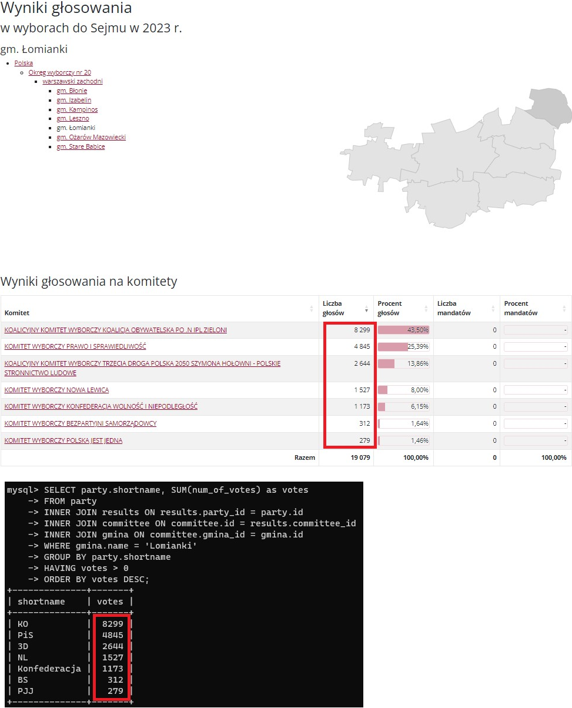
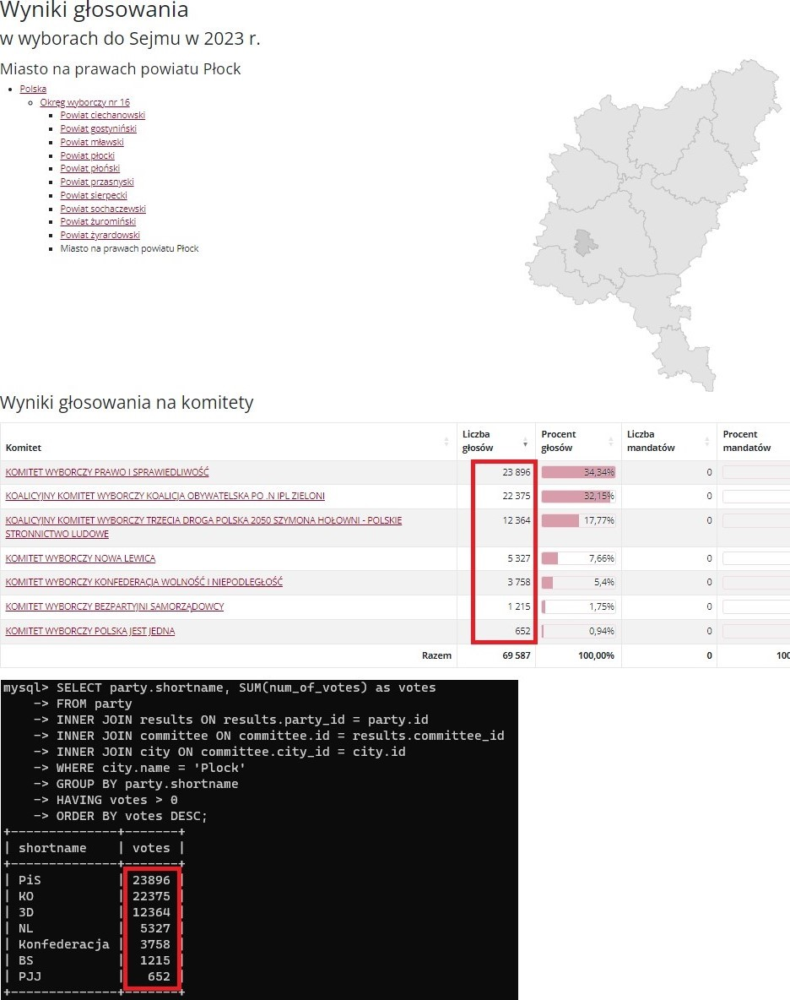

# 2023-election-app

> Web app that visualizes the votes distribution of the 2023 Polish parliamentary election.

https://github.com/h4em/2023-election-app/assets/72524655/f1e38003-9a9a-4eb4-82c1-d0586c17eac8

https://github.com/h4em/2023-election-app/assets/72524655/553669c8-a649-4309-bdbe-0e4353b90fde

## About 
This repo showcases a simple web-app project I've made on the side. It's all about visualising the 2023 Parliamentary election data available @[wybory.gov.pl/sejmsenat2023/](https://wybory.gov.pl/sejmsenat2023/pl/dane_w_arkuszach).

## Tech used

  
  
  
  
  
  
  
  
  
  
  

<!-- 

    img sources
    https://github.com/marwin1991/profile-technology-icons
    https://simpleicons.org/?q=connector

 -->

## How it works
- The user searches for a place name via the searchbar with categories to choose from: 'Address', 'City', 'Gmina', 'Powiat', 'Wojewodztwo' and gets nice charts in return. 
- The place location is visualised on a map. 
- Note that lookup for category 'Address' provide results for the **exact building** in which the voting took place, so for e.g 'Szkola Podstawowa xxx' ([see here](#mobile-preview)). 
- Data from **abroad** / **ships** was **excluded**.

## How it's made
- I downloaded the original .csv files and parsed them to make a relational database. Used Pandas and MySQL, [see the ERD here](res/entity-relationship-diagram.png). 
- [/data/](/data/) directory is where i do the parsing / database insertions with SQLAlchemy.
- Made a Flask server with endpoints that enable looking up places and their corresponding voting results, again, used SQLAlchemy and AJAX for this.
- Used [Nominatim API](https://nominatim.org/) for place location and GeoJSON data fetching, which is then represented on a [Leaflet](https://leafletjs.com/) map.
- Used [Chart.js](https://www.chartjs.org/) for charts.
- Made it somewhat responsive with CSS Flexbox.

## Data integrity
Here are some screenshots comparing my results with the official ones. For majority of cases they should check out.

  
  

  
  

