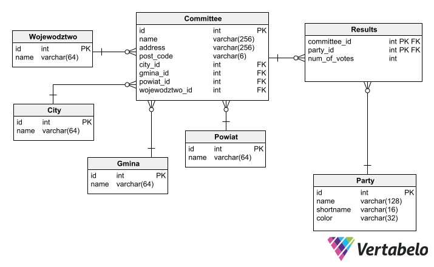

# 2023-election-app

> Full-stack web app that visualizes the votes distribution of the 2023 Polish parliamentary election.

https://github.com/h4em/2023-election-data-analysis/assets/72524655/c69d7ce7-9199-4547-8ac5-ae9a73ac736a?width=1080&height=600

## About 
This repo showcases a simple web-app project I've made on the side. It's all about visualising the 2023 Parliamentary election data available @[wybory.gov.pl/sejmsenat2023/](https://wybory.gov.pl/sejmsenat2023/pl/dane_w_arkuszach).

## Features 
<!-- 

    image source: https://github.com/marwin1991/profile-technology-icons
    https://simpleicons.org/?q=connector

 -->

## Tech used

  
  
  
  
  
  
  
  
  
  
  
  
    

## Data integrity
It would be a damn shame if lookup was to produce false results, so i ran some tests. I can't guarantee they're 100% correct, but for the majority of cases the data should check out.

  
  

## Entity relationship diagram

  

## Notes
Some things worth mentioning:
- Data from **abroad** / **ships** was ***excluded***.
